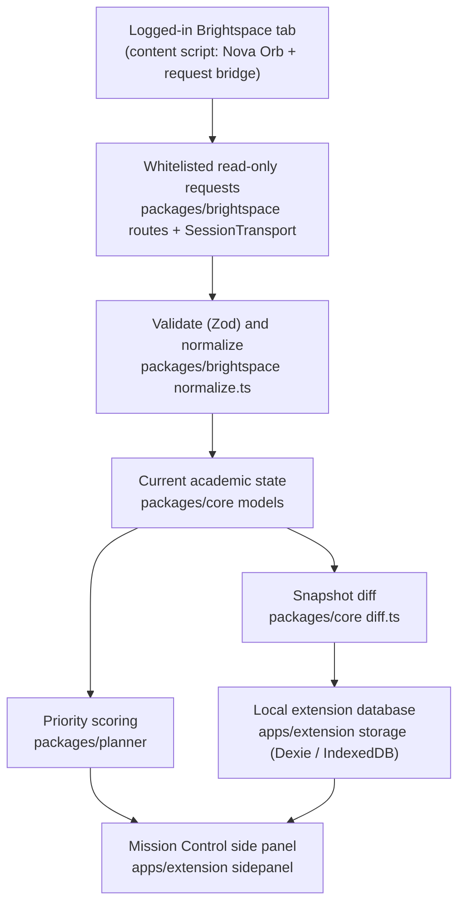

# Architecture

Nova Agent is local-first. The extension reads approved Brightspace data through the student's own logged-in browser session, normalizes it before anything else touches it, and keeps every snapshot, change event, and preference in IndexedDB inside the extension origin. Nothing academic is sent to `apps/api` or any third party.

## Data flow (implemented)



1. The side panel's `SyncCoordinator` asks the Chrome host for a Brightspace tab and pings the content script.
2. `BrightspaceClient` discovers API versions (`/d2l/api/versions/`, cached 24 h), loads `whoami`, active enrollments, then per course (three at a time) assignment folders, quizzes, and news. Submission status is fetched lazily per folder and bounded by the same concurrency.
3. Every request is a typed `ApprovedBrightspacePath`. The side panel validates it, the content script validates it again against the same allowlist, issues a same-origin `fetch` with `credentials: "include"`, and returns only a sanitized `RawResponse` (status, content type, parsed JSON, rate-limit headers). Cookies are never read.
4. Responses are validated with Zod (unknown fields stripped) and mapped to canonical `Course`, `AcademicItem`, and `Announcement` models with stable keys `{tenant}|{user}|{kind}|{course}|{sourceId}`.
5. `carryForwardKnownStatuses` preserves a previously known submission state when the status route is permission-limited, then `createSnapshot` and `diffSnapshots` compare against the most recent snapshots for the same user.
6. `saveSyncOutcome` stores the snapshot, deduplicated events, and sync status in a single Dexie transaction and applies retention (20 snapshots per user; 30 days or 2,000 events).
7. The side panel renders from live Dexie queries. `buildDashboard` derives buckets, counts, the ranked list, the week agenda, and change groups from one filtered set so every number agrees. `packages/planner` scores eligible items deterministically and explains the top two components.

## Boundaries

| Area | Responsibility |
|---|---|
| `packages/brightspace` | Route allowlist and builders, version discovery, both paging forms, retries and rate limiting, session detection, Zod schemas, error union, normalization, feasibility probe, demo tenant fixtures |
| `packages/core` | Canonical models, stable keys, local-timezone deadline buckets, snapshots, retention constants, semantic diff |
| `packages/planner` | Pure priority score, stable ordering, reason text |
| `apps/extension` | Manifest V3 lifecycle, Nova Orb content script, typed messaging, Chrome host boundary, Dexie persistence, sync coordinator, Mission Control UI |
| `apps/web` | Public demo only. Untouched by this slice. |
| `apps/api`, `packages/agent` | Placeholders. Not used by features A–D. |

## Sync state machine

```
idle → checking-session → discovering-versions → loading-courses
     → loading-course-data → normalizing → comparing → saving → ready
```

Recoverable or terminal: `session-expired | permission-required | offline | partial | failed`.

- One in-flight sync at a time; manual and automatic requests share it.
- Cached data renders immediately; a refresh runs on explicit action or when the panel opens with data older than 15 minutes. No polling.
- `lastAttemptedSyncAt` and `lastSuccessfulSyncAt` are stored separately. A failed refresh keeps the last good snapshot and labels it stale.
- Removals are only computed for courses in the successful part of a sync, and only after two consecutive successful observations without the item.

## Extension surfaces

- **Content script** (`src/content.ts`, ~8 KB, isolated world, top frame only): injects a 44×44 px Nova Orb in a closed Shadow DOM, shows the unread badge from `chrome.storage.local`, forwards the click as `OPEN_PANEL`, and answers `PING` and `BRIGHTSPACE_FETCH` only for senders with this extension's id and no tab.
- **Service worker** (`src/background.ts`): opens the side panel for the sender's tab when the message comes from the tenant origin. Also enables opening the panel from the toolbar action.
- **Side panel** (`src/sidepanel/`): React 19 + Radix primitives + Lucide icons. Owns Dexie and the sync coordinator. Never fetches arbitrary URLs; it only sends approved paths to the bridge and opens links that pass `isSafeTenantLink`.

Messages are a discriminated union (`OPEN_PANEL`, `PING`, `BRIGHTSPACE_FETCH`, `SYNC_REQUEST`, `SYNC_PROGRESS`, `SYNC_RESULT`) validated on receipt. Bridge responses are validated with Zod in the side panel.

## Authentication outcome

See [BRIGHTSPACE_ACCESS.md](./BRIGHTSPACE_ACCESS.md). In short: the feasibility probe is implemented and runs inside the extension when a student clicks **Connect to Brightspace**. It could not be executed against the Villanova tenant from the development environment (the host is blocked by the sandbox egress policy), so live access is unverified. Fixture mode is complete and clearly labeled, and the transport boundary is ready for an OAuth 2 adapter once Villanova registers the app.

## Data retention and privacy

- Stored locally only: normalized academic metadata, change events, sync status, UI preferences, resolved API versions, and the sanitized feasibility report.
- Never stored or logged: cookies, tokens, raw HTML, raw Brightspace payloads, announcement attachments.
- **Clear local Nova data** in the panel menu wipes every table after confirmation.
