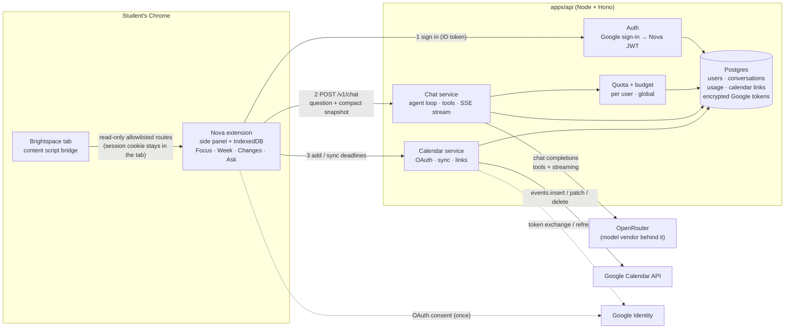
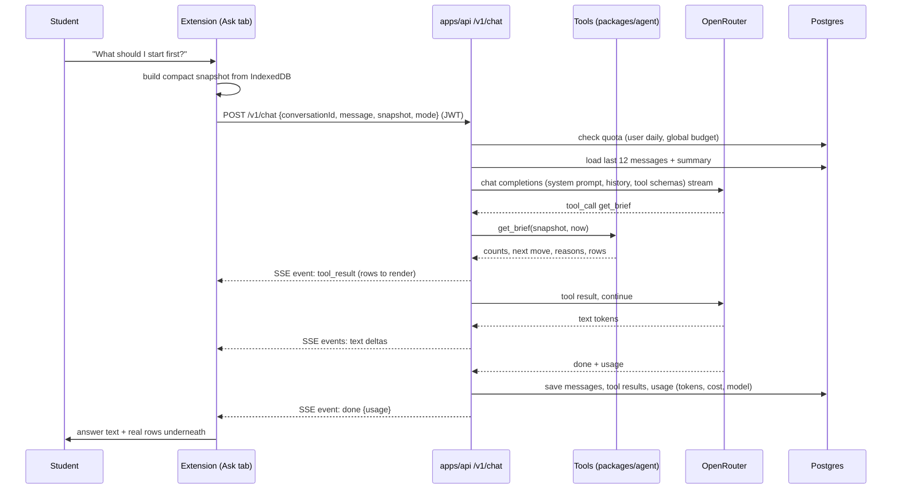

# Nova backend: plan for the AI and calendar services

Status: proposal. Replaces the "no backend" position in `CHATBOT_PLAN.md` for the AI and Google Calendar features. Brightspace access is unchanged.

## Why a backend

| You gain | You take on |
|---|---|
| The OpenRouter key never leaves the server. Anyone with the extension can use Ask Nova on the team allotment. | Hosting, secrets, uptime, a deploy pipeline. |
| Quotas and a budget kill switch in one place. | Course data passes through your server during a chat. The privacy promise changes and must say so. |
| Prompts, tool schemas, and model choice change without reloading every extension. | An account system: students sign in so you know who is spending. |
| Google Calendar sync runs server-side with a refresh token, so it works with the browser closed. | Storing Google refresh tokens, encrypted, with a way to disconnect and delete. |
| Conversation history across devices, usage reports for the project write-up. | More code: a second app, a database, migrations. |

What a backend cannot do: read Brightspace. Reads still go through the student's logged-in tab, because Villanova's Brightspace only trusts the browser session. The extension stays the only place that holds academic data at rest.

## System diagram



## How a chat turn works

The extension sends the question plus a **compact snapshot**: courses, active items, recent announcements, and change events, with titles, dates, statuses, and links only. Around 10 to 40 KB. The server runs the tools over that in memory for the duration of the request and does not store it. This keeps every tool server-side with no callback protocol, and keeps academic data off the database.



Rules the loop enforces:
- At most 4 tool rounds, then a forced final answer.
- Read and navigate tools run automatically. Write tools (calendar create, update, delete) return a **proposal** event; the extension shows a confirmation card; only a confirmed proposal is executed, by a separate request.
- A final answer that names an item no tool returned in that turn is sent back once for correction.
- Demo mode is passed through and the system prompt says the data is fictional.

## How calendar connect and sync work

```mermaid
sequenceDiagram
  participant S as Student
  participant E as Extension
  participant A as apps/api
  participant G as Google

  S->>E: "Connect Google Calendar"
  E->>A: GET /v1/calendar/connect (JWT)
  A-->>E: Google consent URL (state bound to user)
  E->>G: chrome.identity.launchWebAuthFlow(consent URL)
  G-->>A: redirect /v1/calendar/callback?code&state
  A->>G: exchange code → access + refresh token
  A->>A: encrypt refresh token, store
  A-->>E: connected

  S->>E: "Add Lab 3 to my calendar" (row button or chat proposal confirmed)
  E->>A: POST /v1/calendar/sync {items:[{key, title, course, dueAt, url}]}
  A->>A: for each item: lookup calendar_links by (user, key)
  A->>G: events.insert or events.patch (by stored event id)
  A-->>E: {links:[{key, eventId, htmlLink}]}
  E->>E: store link in IndexedDB, show "On calendar" badge

  Note over E,A: On a due-date-changed event the extension calls sync again with the new date; the server patches the same Google event.
```

## API contract (`packages/protocol`, Zod, shared by extension and server)

| Method | Path | Purpose |
|---|---|---|
| POST | `/v1/auth/google` | Verify Google ID token from `chrome.identity`, issue Nova JWT (15 min) + refresh (30 days) |
| POST | `/v1/auth/refresh` | Rotate tokens |
| GET | `/v1/me` | Profile, connections, quota remaining |
| POST | `/v1/chat` | One turn, SSE response: `text`, `tool_result`, `proposal`, `done`, `error` |
| POST | `/v1/proposals/:id/confirm` | Execute a confirmed write proposal |
| GET/DELETE | `/v1/conversations`, `/v1/conversations/:id` | History and deletion |
| GET | `/v1/calendar/connect`, `/v1/calendar/callback` | OAuth |
| DELETE | `/v1/calendar` | Disconnect and delete the stored token |
| POST | `/v1/calendar/sync` | Create or update events for items; returns links |
| GET | `/v1/usage` | Tokens and cost, per day and total |
| DELETE | `/v1/me` | Delete account and all rows |
| GET | `/healthz` | Liveness |

## Data model (Postgres, Drizzle ORM)

- `users` (id, google_sub, email, created_at)
- `refresh_tokens` (user_id, token_hash, expires_at)
- `google_connections` (user_id, refresh_token_enc, scope, connected_at)
- `conversations` (id, user_id, title, summary, created_at, updated_at)
- `messages` (id, conversation_id, role, content, tool_calls, tool_results, created_at)
- `proposals` (id, user_id, kind, payload, status, created_at)
- `calendar_links` (user_id, item_key, google_event_id, last_hash, updated_at)
- `usage` (id, user_id, model, prompt_tokens, completion_tokens, cost_usd, created_at)

Nothing academic is stored except what appears inside saved messages and tool results. That is the one privacy cost, and a per-user "do not save my conversations" setting removes it.

## Stack and hosting

- **Runtime**: Node 22, TypeScript, Hono (small, standard `fetch` handlers, easy to test without a network).
- **Database**: Postgres on Neon or Supabase free tier. Drizzle for schema and migrations.
- **Model**: OpenRouter through the OpenAI-compatible chat completions API; the adapter also works against OpenAI directly by base URL.
- **Hosting**: Fly.io or Render, one small instance, Docker image built by GitHub Actions on `master`. Secrets: `OPENROUTER_API_KEY`, `GOOGLE_CLIENT_ID`, `GOOGLE_CLIENT_SECRET`, `JWT_SECRET`, `DATABASE_URL`, `TOKEN_ENCRYPTION_KEY`.
- **Extension side**: `optional_host_permissions` for the API origin, requested when the student signs in.

## Security and budget

- CORS allows only `chrome-extension://<id>`. JWT required on every route but health and the OAuth callback.
- Per-user daily token cap and a global monthly dollar cap with a kill switch env var. When either trips, `/v1/chat` returns a typed error and the Ask tab falls back to the no-model intent matcher.
- Rate limit per user (for example 20 turns per 10 minutes).
- Refresh tokens encrypted at rest with a server key; never returned to the client.
- No prompt or answer content in logs; only ids, model, tokens, latency.
- Account deletion removes every row, including calendar links (Google events are left in the student's calendar, they own them).

## Where the code goes

```
apps/api/            Hono app: routes, auth, chat, calendar, budget, db
packages/protocol/   Zod schemas for every request, response, and SSE event
packages/agent/      tools (pure), agent loop, model adapters (server-only)
apps/extension/      Ask tab, sign-in, streaming client, compact snapshot builder,
                     confirmation cards, calendar buttons and badges
```

`packages/agent` stays pure so the same tools run in tests, in the intent matcher inside the extension (offline fallback), and on the server.

## Delivery plan

Each step is a PR into `main`, `npm run check` green, then a release to `master`.

0. **Accounts**: Google Cloud project with an OAuth client (Web application type, since the server does the exchange), OpenRouter key, Neon database, Fly or Render app. No code.
1. **Skeleton**: `packages/protocol`, `apps/api` with Hono, health, Google sign-in, JWT, Drizzle migrations, Dockerfile, deploy workflow. Extension gets a Sign in control and the API origin permission.
2. **Tools and loop**: `packages/agent` tools over the compact snapshot, the loop with `ScriptedModel`, unit tests, the honesty check.
3. **Chat endpoint**: `/v1/chat` with SSE, the OpenRouter adapter, usage recording, quotas. Recorded-stream tests only in CI.
4. **Ask tab**: streaming client, compact snapshot builder, message list with rendered rows, composer, states (signed out, offline, quota reached, demo), intent-matcher fallback, conversations list.
5. **Calendar**: OAuth routes, encrypted token storage, `/v1/calendar/sync`, row-level "Add to calendar", sync on deadline moves, chatbot proposals and confirmation cards.
6. **Hardening and docs**: rate limits, kill switch, account deletion, privacy text in `PRODUCT.md` and README, usage page for the report.

Steps 1, 2, and 4 need no OpenRouter access. Step 3 is built against recorded responses and goes live when the key arrives.

## Open decisions

1. Hosting: Fly.io or Render. Both have a free or near-free tier that fits.
2. Save conversations by default, or opt in.
3. Per-user daily token cap and the global monthly dollar cap.
4. Whether sign-in is required for the whole extension or only for Ask and Calendar (recommended: only for those; Focus, Week, and Changes stay local and account-free).
